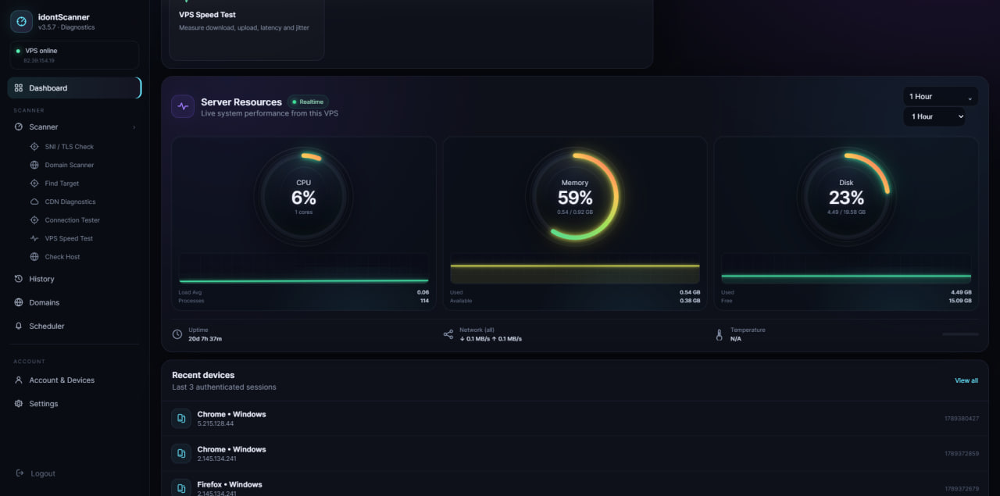
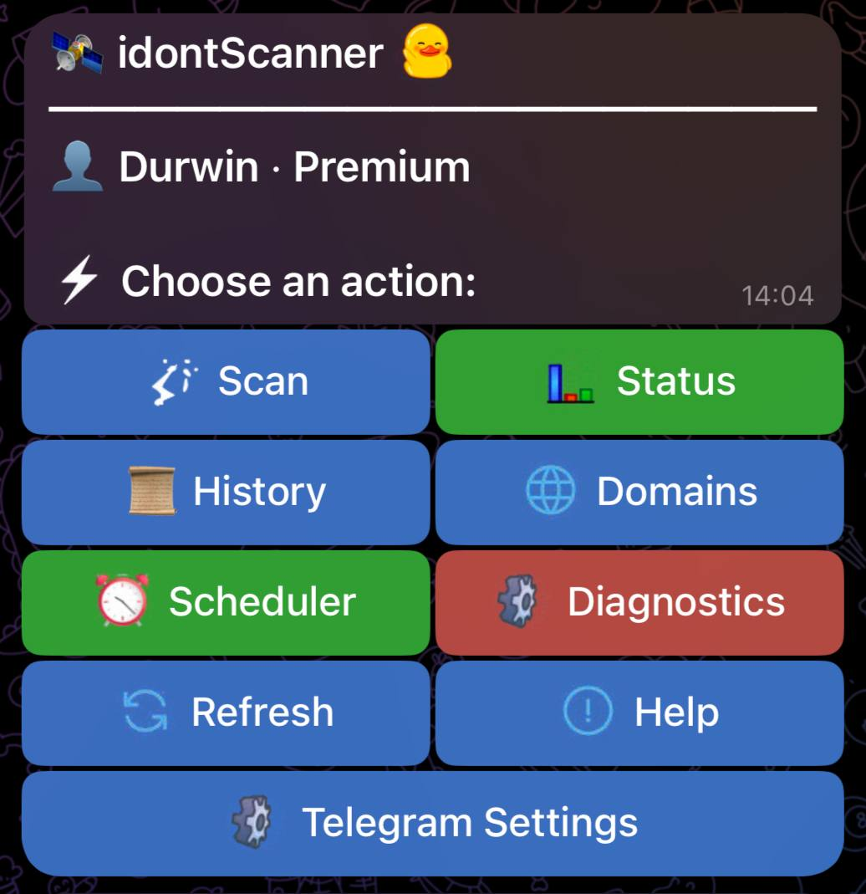
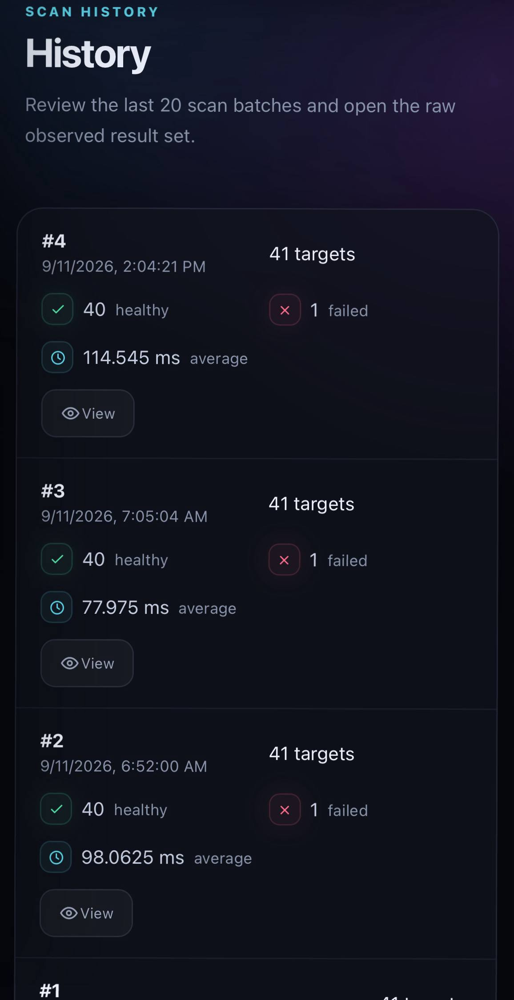

**🇮🇷 فارسی | 🇬🇧 English | 🇷🇺 Русский | 🇨🇳 中文**

[فارسی](README.md) · [English](README.en.md) · [Русский](README.ru.md) · [中文](README.ch.md)

---

# ⚡ idontScanner

<p align="center">
  
</p>

### Профессиональная панель обнаружения и диагностики SNI / TLS для VPS

**idontScanner** — это лёгкая, быстрая и Self-Hosted панель для проверки состояния TLS-соединения, времени DNS/TCP/TLS, сертификатов, ALPN, Cipher, состояния домена и истории сканирований.

> 🎯 Цель проекта: предоставить чистый и надёжный инструмент для **диагностики сети / TLS на целях, которые вы имеете право проверять**.
>
> Проект не предназначен для массового сканирования Интернета, генерации настроек для обхода сетевых ограничений или создания рабочих конфигураций для обхода фильтрации.

---

## 🚀 Быстрая установка

Самый быстрый способ установки через GitHub:

```bash
curl -fsSL https://raw.githubusercontent.com/durwinam/idontScanner/main/install.sh | sudo bash
```

Установщик автоматически:

- Устанавливает Python и необходимые зависимости.
- Создаёт отдельное Virtual Environment.
- Создаёт системного пользователя `idontscanner`.
- Подготавливает базу данных SQLite.
- Запрашивает имя пользователя и пароль администратора.
- Предлагает порт `8088` и, если он занят, выбирает следующий свободный порт.
- Включает systemd-сервис.
- Выполняет Health Check.
- Если включён UFW, настраивает правило для порта панели.

### Установка из ZIP-файла

```bash
unzip idontScanner-v3.0.5.zip
cd idontScanner-3.0.5
sudo bash install.sh --fresh
```

> `--fresh` удаляет предыдущую установку, базу данных и предыдущие настройки. Не используйте эту опцию для обычного обновления.

---

<p align="center">
  
</p>

## 🔄 Обновление без переустановки

После установки больше не нужно запускать установщик при каждом обновлении.

### Рекомендуемый способ

```bash
sudo idontScanner update
```

### Прямой способ

```bash
sudo bash /opt/idontScanner/update.sh
```

Обновление:

- Загружает новый исходный код из GitHub.
- Сохраняет `.env`.
- Сохраняет базу данных SQLite.
- Сохраняет имя пользователя / пароль.
- Сохраняет историю.
- Сохраняет домены.
- Сохраняет настройки Telegram.
- Сохраняет Scheduler.
- Обновляет зависимости.
- Выполняет миграцию базы данных.
- Перезапускает сервис.
- Выполняет Health Check.

---

## 🖥️ CLI управления

При выполнении:

```bash
sudo idontScanner
```

вы получите доступ к полному меню управления:

| Опция | Использование |
|---|---|
| 🔐 Reset Password | Изменить пароль администратора |
| 🌐 Panel Address | Показать адрес панели |
| 🔌 Change Port | Изменить HTTP-порт |
| 🔄 Update | Обновить без удаления информации |
| 🤖 Telegram | Управление Token / Owner / Admin |
| 📊 Status | Статус сервиса |
| 📜 Logs | Просмотр логов |
| ♻️ Restart | Перезапуск + Health Check |
| 🧹 System Info | Информация об установке и системе |

### Прямые команды

```bash
sudo idontScanner update
sudo idontScanner status
sudo idontScanner restart
sudo idontScanner logs
sudo idontScanner version
sudo idontScanner help
```

---

## 🔍 Сканеры

### ⚡ VPS Speed Test

Dedicated VPS network test for bounded Download, Upload, Latency and Jitter measurements.

### 🎯 Custom Ping Target

Domain scans can optionally use a user-supplied IP as the TCP/TLS connection target while preserving the scanned hostname as SNI.

### 🌐 Domain Scanner

TLS-сканирование активных доменов с отображением:

- Статус
- Задержка
- DNS Time
- TCP Time
- TLS Handshake
- TLS Version
- ALPN
- Cipher
- IP
- Сертификат
- Издатель
- Срок действия
- SAN

Стандартный TLS-порт в Scanner — **443**, и внутри он хранится отдельно от Host; поэтому SNI всегда остаётся чистым hostname.

### 🎯 SNI / TLS Check

Проверка поведения TLS для определённой цели и SNI без изменения стандартной логики HTTPS-соединения.

### ☁️ CDN Diagnostics

Проверка определённого Endpoint с отображением информации о соединении и Provider Hint для диагностики CDN.

### ⚡ Connection Tester

Connection Tester автоматически определяет конфигурации, созданные Xray-совместимыми панелями, и поддерживает следующие форматы для определения Endpoint:

- VLESS
- VMess
- Trojan
- Shadowsocks
- Hysteria2
- WireGuard `.conf`

Для конфигураций с TCP/TLS на уровне Endpoint проверяется следующая информация:

- Host / Port
- Protocol / Transport
- Security / SNI
- DNS / TCP / TLS timing
- TLS Version
- ALPN
- Cipher
- Destination IP

Для UDP/QUIC-протоколов, таких как Hysteria2, Shadowsocks и WireGuard, программа не сообщает об успешном TCP-соединении как об успешной работе протокола и отображает только связанную с Endpoint/DNS информацию.

Также выполняются тесты прямого доступа к Instagram / YouTube / Telegram непосредственно с VPS. Для маршрутизации трафика сервисов введённая конфигурация не используется.

> UUID, пароль, auth и приватный ключ не отображаются в выводе, а конфигурация не сохраняется для постоянного хранения.

---

## 📡 Диагностика сервисов

Следующие сервисы проверяются для диагностики Reachability непосредственно с VPS:

- Instagram
- YouTube
- Telegram

Каждый сервис проверяется с несколькими попытками, а следующие метрики выводятся:

- DNS
- TCP
- TLS
- HTTP Response
- Min
- Max
- Average
- Jitter
- HTTP Status

Эти значения показывают **задержку от VPS → Endpoint сервиса** и не должны восприниматься как фактическая общая скорость работы сервиса.

---

## 🤖 Telegram Bot

Telegram является необязательным и работает через **Polling**, поэтому для использования бота не требуется размещать панель за HTTPS или Webhook.

Настройки можно изменить в:

**Settings → Telegram Bot**

Доступные настройки:

- Bot Token
- Owner Telegram ID
- Несколько Telegram ID администраторов

Только зарегистрированный Owner и Admins могут использовать бота.

### Команды

```text
/start
/menu
/scan
/status
```

<p align="center">
  
</p>

---

## ⏱ Scheduler

Scheduler отключён по умолчанию, а его настройки сохраняются в SQLite.

Доступные интервалы:

```text
30 минут
1 час
1,5 часа
2 часа
3 часа
6 часов
12 часов
24 часа
```

Также можно выбрать отправку результатов всех сканирований или только результатов, требующих внимания.

---

## 🔐 Безопасность

- Пароли не хранятся в открытом виде.
- Хэши паролей создаются с использованием Salt и `scrypt`.
- Сессии подписываются отдельным Secret.
- Mutation API защищены CSRF.
- Сервис работает от отдельного пользователя `idontscanner`.
- Systemd работает с `NoNewPrivileges` и ограничениями файловой системы.
- Ввод домена проверяется как hostname.
- Данные SQLite хранятся за пределами исходного кода приложения.
- Обновление не удаляет локальную информацию.

---

## 🗂️ Структура проекта

```text
idontScanner-3.0.5/
├── app/
│   ├── auth.py
│   ├── config.py
│   ├── connection.py
│   ├── database.py
│   ├── main.py
│   ├── scanner.py
│   ├── scheduler.py
│   ├── security.py
│   └── telegram.py
│
├── static/
├── templates/
├── systemd/
├── install.sh
├── update.sh
├── idontscanner-cli
├── requirements.txt
├── VERSION
└── LICENSE
```

Код проекта поддерживается в модульной структуре, поэтому Scanner, Database, Authentication, Telegram и Scheduler отделены друг от друга, а не находятся в одном большом файле, что упрощает разработку и обслуживание.

---

## 🛠️ Управление сервисом

```bash
sudo systemctl status idontscanner
sudo systemctl restart idontscanner
sudo journalctl -u idontscanner -f
```

---

## 🧹 Полностью чистая установка

Если вы действительно хотите удалить всю предыдущую информацию:

```bash
sudo bash install.sh --fresh
```

⚠️ Этот режим удаляет базу данных, историю, домены, Telegram, Scheduler и предыдущую учётную запись пользователя.

<p align="center">
  
</p>

---

## 📌 GitHub

Основной репозиторий проекта:

**https://github.com/durwinam/idontScanner**

Прямая установка с GitHub:

```bash
curl -fsSL https://raw.githubusercontent.com/durwinam/idontScanner/main/install.sh | sudo bash
```

---

## 📦 Версия

**v3.0.5**

---

## 📄 Лицензия

MIT License — Copyright © 2026 **durwinam**

